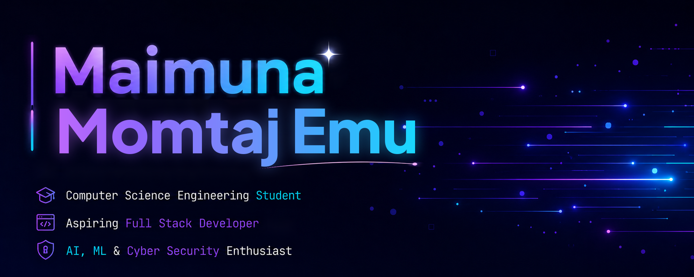

<!-- ========== BANNER ========== -->

  

<h1 align="center">Hi, I'm Maimuna Momtaj Emu</h1>

<h3 align="center">
  Computer Science Engineering Student | Aspiring Full Stack Developer
</h3>

  AI/ML & Cybersecurity Enthusiast

---

<!-- ========== ABOUT ME ========== -->

##  About Me

I'm a Computer Science and Engineering student passionate about
building web applications, exploring intelligent systems, and
learning how to make technology more useful and secure.

-  Currently pursuing my degree in Computer Science & Engineering.
   Learning full-stack web development and strengthening my programming fundamentals.
-  Exploring Artificial Intelligence and Machine Learning.
-  Interested in cybersecurity and secure software development.
-  Always curious to learn new technologies and build meaningful projects.

<!-- ========== CURRENT ACTIVITIES ========== -->

##  What I'm Up To

-  Improving my skills in frontend and backend development.
-  Practicing Python and problem-solving.
-  Exploring AI/ML concepts and research opportunities.
-  Working on personal and academic projects.

<!-- Replace or remove any activity that doesn't reflect your current work -->

<!-- ========== SKILLS ========== -->

##  Languages and Tools

  
   
  
   
  

<!-- ========== SOCIAL LINKS ========== -->

##  Connect With Me

  
 

<!-- ========== CONTRIBUTION GRAPH ========== -->

##  Contribution Activity

##  Featured Projects

<h2 align="center"> CareMeds-SD</h2>

  

 

<h2 align="center"> Ed-Bridge</h2>

  

   <i>Keep learning, keep building, keep growing.</i> 

